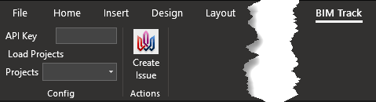

# BIMTrackWordAddIn
A BIM Track Add-in for Word!

## Dependencies
- [RestSharp](http://restsharp.org/) (for requests to the BIM Track API and processing the received data).
- [Microsoft Office SDK](https://docs.microsoft.com/en-us/visualstudio/vsto/getting-started-office-development-in-visual-studio?view=vs-2017).
- .NET 4.0 or greater.

## Code Usage
1. Open BIMTrackWordAddIn.sln in Visual Studio 2017+
2. Install RestSharp using NuGet package manager.
3. Compile & Run in debug mode (this should launch Word and load the Add-in into the ribbon).

## Word Add-in Usage
1. Enter your [BIM Track Hub API key](https://bimtrack.co/resources/api) in the ribbon area for it.
2. Load the projects.
3. Select the project to push your issues to.
4. Select a line of text and an image.
5. Click on "Create Issue" button.
6. You just uploaded something to your hub.

## Known issues
- Currently cannot upload more than one image (not an API limitation, just a limitation of the code in this prototype).
- If a newline character is found in the selected text, it is replaced by an empty string ("").
- API key entered is not remembered from one session of word to the next.

## Ideas for future improvements
Please submit your ideas by creating a Github project issue. DO NOT contact BIM Track support nor submit it to BIM Track ideas.

- Get data from BIM Track to create reports in Word.
- Memorize user credentials.
- Upload multiple issues from a table in one click.

## License
GNU GPLv3 - https://choosealicense.com/licenses/gpl-3.0/

Permissions:
- Commercial use ✅
- Distribution ✅
- Modification ✅
- Private use ✅

Conditions:
- Disclose source
- License and copyright notice
- Same license

©2019 Construction Virtuelle et Technologie BIM One inc.
